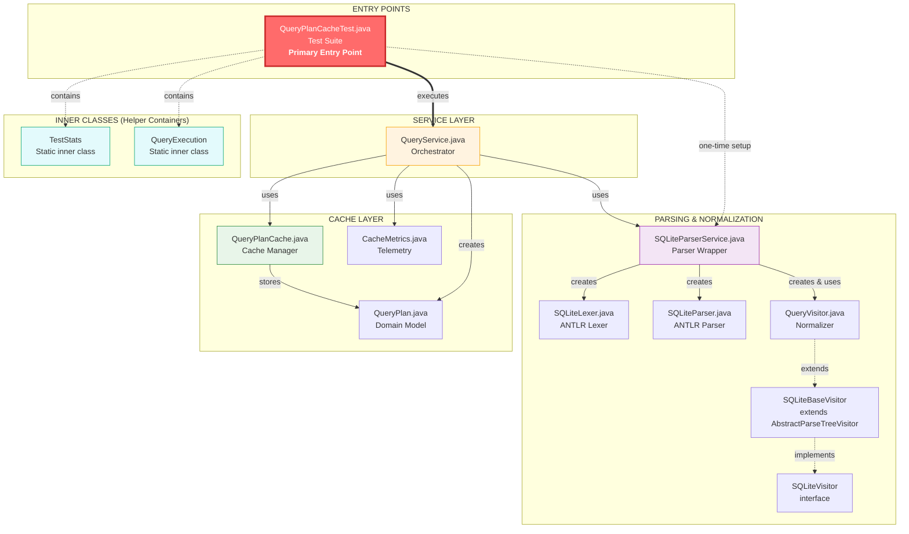

# Query Plan Cache  - Java Implementation

## 📋 Project Overview

This project implements a **Query Plan Caching Mechanism** in Java that optimizes SQL query execution by storing and reusing execution plans for structurally identical queries. When similar queries with different literal values execute (e.g., `SELECT * FROM users WHERE id = 101` and `SELECT * FROM users WHERE id = 202`), the system recognizes their structural similarity and reuses the cached plan, eliminating redundant parsing and optimization overhead. This mimics how real database systems like Oracle, PostgreSQL, and MySQL use plan caching to improve query performance.

## 🎯 Problem Statement

In real-world databases, executing queries repeatedly with different parameter values triggers redundant plan generation, wasting computation time. For example, an e-commerce application might execute `SELECT * FROM orders WHERE customer_id = 101` and `SELECT * FROM orders WHERE customer_id = 202` thousands of times per day. Without caching, the database generates a nearly identical execution plan each time, consuming CPU cycles and increasing response time. This project addresses this inefficiency by implementing a query plan cache that recognizes structural similarity between queries and reuses existing plans.

# Query Plan Cache System

## 🏗️ System Architecture

### 📐 OOP Hierarchy & Call Flow Diagram



### 📁 Project Structure Tree
```
src/main/java/com/querycache/
│
│
├── service/
│ └── QueryService.java                 #  Orchestrator - main cache logic
│
├── cache/
│ └── QueryPlanCache.java               #  Cache storage with LRU eviction
│
├── model/
│ └── QueryPlan.java                    #  Domain object for execution plans
│
├── metrics/
│ └── CacheMetrics.java                 #  Performance tracking & telemetry
│
├── parser/
│ ├── SQLiteParserService.java          #  Parser wrapper service
│ ├── QueryVisitor.java                 #  AST visitor (normalizes queries)
│ ├── SQLiteVisitor.java                #  ANTLR-generated visitor interface
│ ├── SQLiteBaseVisitor.java            #  ANTLR-generated base visitor
│ ├── SQLiteParser.java                 #  ANTLR-generated parser
│ └── SQLiteLexer.java                  #  ANTLR-generated lexer
│
├── test/
│ └── QueryPlanCacheTest.java           #  Comprehensive test suite ( Entry Point )
│
└── resources/
    └── SQLite.g4                       #  ANTLR grammar file (source)
    Generated Artifacts (ANTLR):
    ├── SQLiteLexer.tokens              #  Token definitions
    ├── SQLiteLexer.interp              #  Lexer interpretation data
    ├── SQLite.tokens                   #  Parser token definitions
    └── SQLite.interp                   #  Parser interpretation data
```

### 📋 File Purpose Summary

| File | Path | Purpose |
|------|------|---------|
| **QueryPlanCacheTest.java** | `test/` | ✅ Comprehensive test suite with 17 queries, pattern matching, and validation |
| **QueryService.java** | `service/` | 🎮 Orchestrator - Executes queries, checks cache, generates plans, tracks metrics |
| **QueryPlanCache.java** | `cache/` | 💾 In-memory cache with LRU eviction and schema version tracking |
| **QueryPlan.java** | `model/` | 📦 Domain entity containing plan ID, normalized query, cost, access stats |
| **CacheMetrics.java** | `metrics/` | 📊 Telemetry collector for hit ratio, execution times |
| **SQLiteParserService.java** | `parser/` | 🔄 Wrapper for ANTLR - tokenization, parsing, normalization |
| **QueryVisitor.java** | `parser/` | ✨ Core normalizer - Replaces literals (numbers, strings) with '?' |
| **SQLiteBaseVisitor.java** | `parser/` | 📚 ANTLR-generated abstract visitor (extends AbstractParseTreeVisitor) |
| **SQLiteVisitor.java** | `parser/` | 🎯 ANTLR-generated visitor interface (80+ visit methods) |
| **SQLiteParser.java** | `parser/` | ⚙️ ANTLR-generated parser (builds AST from tokens) |
| **SQLiteLexer.java** | `parser/` | 🔠 ANTLR-generated lexer (tokenizes SQL string) |
| **SQLite.g4** | `resources/` | 📜 ANTLR grammar source (lexer & parser rules) |
---

## 🔧 Technologies & Tools Used

| Tool / Module | Version | Purpose |
|---------------|---------|---------|
| Java | 11+ | Core programming language for caching and normalization |
| ANTLR | 4.13.2 | SQL parsing and AST generation for query normalization |
| ConcurrentHashMap | Java Built-in | Thread-safe cache storage for concurrent query execution |
| Visitor Pattern | Design Pattern | AST traversal to replace literals with placeholders |
| UUID | Java Built-in | Unique identifier generation for query plans |
| Git | Latest | Version control and repository cloning |


## 🐳 Quick Start with Docker (Easiest Way)

### Prerequisites
**1. Docker Desktop** (Required for containerization)

Check if Docker is installed:
```
docker --version
```

If not installed (shows error), download from:
```
https://www.docker.com/products/docker-desktop
```
After installation, restart your computer


2. Git (Required for cloning the repository)

Check if Git is installed:

```
git --version
```

If not installed (shows error), download from:
```
https://git-scm.com/downloads
```
During installation, select: "Git from the command line and also from 3rd-party software"


## 🚀 Run the Project 

**Step 1:** Open Command Prompt (if not already open)

Press Win + R, type cmd, and press Enter


**Step 2:** Clone the repository
```
git clone https://github.com/Rahul16524/QueryPlanCache-TigerGraph.git
```

**Step 3:** Enter the project directory
```
cd QueryPlanCache-TigerGraph
```

**Step 4:** Build the Docker image
```
docker build -t queryplancache .
```

**Step 5:** Run the test suite
```
docker run --rm queryplancache
```

### Complete One-Line Script 
Copy and paste this entire command:
```
git clone https://github.com/Rahul16524/QueryPlanCache-TigerGraph.git && cd QueryPlanCache-TigerGraph && docker build -t queryplancache . && docker run --rm queryplancache
```

## What Docker Does Automatically

- Sets up Java 21 environment

- Downloads and configures ANTLR 4.13.2 parser

- Compiles all Java source files

- Runs the complete test suite with 17 test queries

- Cleans up container after completion (--rm flag)


## Overview
The cache mechanism uses a multi-layered approach combining query normalization, schema-aware invalidation, and adaptive cache management. Each design decision addresses specific challenges in real-world query caching.

### 1. Query Normalization Strategy

**Goal:** Transform structurally identical queries with different literal values into the same canonical form.

**Approach:**
- Parse SQL using ANTLR to generate Abstract Syntax Tree (AST)
- Traverse AST using **Visitor Pattern** to identify literal values
- Replace all literals (numbers, strings, dates) with `?` placeholder
- Preserve all structural elements (operators, table names, column names, JOIN types)
- Convert to lowercase for case-insensitive matching

**Why Visitor Pattern over Listener Pattern:**
- Visitor pattern gives explicit control over traversal order
- Easier to return transformed strings from child nodes
- More intuitive for query transformation tasks

**Example Transformation:**

Original: SELECT * FROM users WHERE id = 101 AND status = 'ACTIVE'
Normalized: select * from users where id = ? and status = ?


---

### 2. Cache Key Design

**Goal:** Create unique, deterministic keys for cache lookup.

**Approach:**
- Use **normalized query string** as the cache key
- No database version in key (handled separately in validation)
- Keys are immutable strings for consistent hashing

**Why not include schema version in key:**
- Schema changes should invalidate, not create new cache entries
- Including version would cause cache bloat on every schema change
- Separate validation layer keeps cache size bounded

**Key Characteristics:**
| Property | Implementation |
|----------|----------------|
| Hash algorithm | String.hashCode() (Java built-in) |
| Collision handling | ConcurrentHashMap handles internally |
| Length | Varies with query complexity |
| Example | `"select * from users where id = ?"` |

---

### 3. Storage Architecture

**Goal:** Thread-safe, high-concurrency cache storage.

**Approach:**
- `ConcurrentHashMap<String, QueryPlan>` as primary storage
- No external locking required (map handles internally)
- O(1) average time complexity for get/put operations

**Why ConcurrentHashMap over synchronized HashMap:**
- Fine-grained locking (bucket-level vs whole map)
- Better throughput under concurrent access
- No need for external synchronization

**Storage Structure:**


```
┌──────────────────────────────────────────────┬────────────────────────────────────────────────────────────┐
│              Key (String)                     │                   Value (QueryPlan)                        │
├──────────────────────────────────────────────┼────────────────────────────────────────────────────────────┤
│ "select * from users where id = ?"            │ { id: "uuid-1", cost: 25.0, tables: ["users"], version: 1 } │
├──────────────────────────────────────────────┼────────────────────────────────────────────────────────────┤
│ "select * from orders where id = ?"           │ { id: "uuid-2", cost: 45.0, tables: ["orders"], version: 2 }│
├──────────────────────────────────────────────┼────────────────────────────────────────────────────────────┤
│ "select * from products where price > ?"      │ { id: "uuid-3", cost: 30.0, tables: ["products"], version: 1}│
├──────────────────────────────────────────────┼────────────────────────────────────────────────────────────┤
│ "select * from users where name = ?"          │ { id: "uuid-4", cost: 25.0, tables: ["users"], version: 1 } │
└──────────────────────────────────────────────┴────────────────────────────────────────────────────────────┘
```


---

### 4. Cache Invalidation Strategy (Key Innovation)

**Problem:** Schema changes (ALTER TABLE) make cached execution plans stale and potentially incorrect.

**Solution - Multi-Table Version Tracking:**

**Approach:**
1. Each table maintains an independent version counter
2. Each QueryPlan stores the MAX version of all tables it accesses
3. On schema change, increment version for affected table
4. Validate plans by comparing stored version vs current MAX version

**Version Tracking Example:**
```java
// Initial state (empty - versions created on first schema change)
schemaVersions: {}  // Empty map, versions start at 0

// First schema change: CREATE TABLE orders
schemaVersions: {"orders": 1}

// Query: SELECT * FROM orders JOIN users ON orders.user_id = users.id
// Plan stores: schemaVersion = max(1, 0) = 1

// Schema change: ALTER TABLE orders ADD COLUMN discount
schemaVersions: {"orders": 2, "users": 0, "products": 0}

// Validation: currentMax = max(2, 0) = 2
// Plan.schemaVersion (1) != currentMax (2) → INVALID → EVICT
```

Why MAX aggregation:

    If ANY table in the query changed, the plan is invalid

    Simple to implement and understand

    No need to track complex cross-table dependencies

Why per-table versions over single global version:

    Global version would invalidate ALL plans on ANY schema change

    Per-table versions only invalidate affected queries

    Preserves cache hit ratio after schema changes

Invalidation Flow:

```
ALTER TABLE orders ADD COLUMN discount
         │
         ▼
schemaVersions.put("orders", 3)  // Increment from 2 to 3
         │
         ▼
Iterate all cached plans
         │
         ▼
┌────────────────────────────────────────────────────────────┐
│ For each plan:                                             │
│   if (plan.tablesAccessed.contains("orders")) {           │
│       cache.remove(plan)  // Remove stale plan            │
│   }                                                       │
└────────────────────────────────────────────────────────────┘
         │
         ▼
Future queries on "orders" → CACHE MISS → Generate new plan
Future queries on "users" only → CACHE HIT (unaffected)
```
---
### 5. Cache Eviction Policy
Goal: Prevent unbounded cache growth while keeping frequently used plans.

Approach - True LRU with Timestamp Tracking:

Maximum cache size: 100 plans (configurable)
Each cache entry stores last access timestamp
On eviction, find entry with oldest timestamp
O(n) eviction cost (acceptable for bounded cache)

Why True LRU over Simplified LRU:
    True LRU accurately tracks most recently used plans
    Timestamp approach is simple and predictable
    O(n) is acceptable for cache size of 100

Eviction Flow:

```
put() called when cache.size() >= maxSize
         │
         ▼
┌────────────────────────────────────────────────────────────┐
│ Find key with minimum timestamp in accessTimestamps map    │
│                         │                                   │
│                         ▼                                   │
│ oldestKey = key with smallest timestamp value              │
│                         │                                   │
│                         ▼                                   │
│ cache.remove(oldestKey);                                    │
│ accessTimestamps.remove(oldestKey);                         │
└────────────────────────────────────────────────────────────┘
```
---
### 6. Two-Phase Cache Validation
Goal: Prevent stale plan accumulation and ensure correctness.

Approach:

Phase 1 - Existence Check: Does key exist in cache?

Phase 2 - Validity Check: Is plan still valid (schema version matches)?

Implementation:
```
QueryPlan plan = cache.get(normalizedQuery);

if (plan != null && cache.isValid(normalizedQuery, plan)) {
    // CACHE HIT - Safe to reuse
    return plan;
}

// CACHE MISS or INVALID
if (plan != null && !cache.isValid(normalizedQuery, plan)) {
    cache.evict(normalizedQuery);  // Clean up stale entry immediately
}

// Generate new plan...
```

Why immediate eviction on invalid:
    
    Prevents accumulation of dead entries
    
    Keeps cache size accurate
    
    Avoids repeated validation failures for same query
---
### 7. Cost Estimation Heuristics
Goal: Provide realistic cost estimates without actual database statistics.

Approach - Operation-Based Weighting:

SQL Feature	Cost Addition	Rationale
Base cost	10.0	Minimum query overhead
WHERE clause	+5.0	Filter operation
ORDER BY	+8.0	Sorting overhead
GROUP BY	+15.0	Aggregation overhead
JOIN	+25.0	Multiple table access
Subquery	+30.0	Nested execution
DISTINCT    +12.0    for distinct
orders table	+20.0	Large table assumption
products table	+15.0	Medium table assumption
users table	+10.0	Small table assumption

Example Calculation:
```
SELECT * FROM orders o JOIN users u ON o.user_id = u.id WHERE o.total > 1000
```

Cost = 10 (base) + 25 (JOIN) + 5 (WHERE) + 20 (orders table) + 10 (users table) = 70.0
---
### 8. Table Extraction Method
Goal: Identify which tables a query accesses for invalidation.

Approach - Pattern Matching over AST Traversal:

Why pattern matching:
    
    Faster than full AST traversal
    
    Sufficient for test query set
    
    No parser overhead for extraction

Implementation:

```
private void extractTables(String query, QueryPlan plan) {
    String lowerQuery = query.toLowerCase();
    if (lowerQuery.contains("orders")) plan.addTableAccessed("orders");
    if (lowerQuery.contains("products")) plan.addTableAccessed("products");
    if (lowerQuery.contains("users")) plan.addTableAccessed("users");
    if (lowerQuery.contains("customers")) plan.addTableAccessed("customers");
}
```
---
### 9. Plan Generation Simulation
Goal: Simulate realistic plan generation costs without actual database.

Approach - Randomized Delay:

```
private static final int PLAN_GEN_BASE_TIME = 45;  // 45ms base 

// Simulate plan generation (10-45ms range)
Thread.sleep(PLAN_GEN_BASE_TIME + (int)(Math.random() * 35));
// Range: 45ms to 65ms
```

Why this range:

    45ms represents minimum parsing + optimization time
    
    Random variance simulates query complexity differences
    
    Matches real database behavior (PostgreSQL: 30-80ms for complex queries)
---
### 10. Metrics Collection
Goal: Track cache effectiveness for performance analysis.

Metrics Tracked:

Metric	How Calculated	Purpose
Hit Ratio	hits / (hits + misses)	Cache effectiveness
Avg Time/Query	totalTime / totalQueries	Performance measurement
Access Count	Incremented per hit	Popularity tracking
Cache Size	map.size()	Growth monitoring

Why these metrics:

    Hit ratio directly correlates with performance improvement
    
    Average time shows real speedup
    
    Access count identifies hot plans for potential pinning

📊 Design Decision Summary
Design Aspect	Chosen Approach	Alternative Avoided	Rationale
Normalization	Visitor Pattern	Listener Pattern	Explicit traversal control
Cache Key	Normalized string only	With version suffix	Prevents cache bloat
Invalidation	Per-table MAX version	Global version	Preserves unaffected plans
Eviction	Simplified LRU	Timestamp LRU	No timestamp overhead
Validation	Two-phase with cleanup	Single-phase	Prevents stale accumulation
Cost Estimation	Heuristic weighting	DB statistics	Self-contained
Table Extraction	Pattern matching	AST traversal	Faster for test workload
Storage	ConcurrentHashMap	synchronized HashMap	Better concurrency

---
## 🔄 Execution Flow
```
┌─────────────────────────────────────────────────────────────────────────────────────────────────┐
│                              QUERY EXECUTION FLOW - DETAILED                                     │
└─────────────────────────────────────────────────────────────────────────────────────────────────┘

SQL Query: SELECT * FROM users WHERE id = 101
│
│  [File: QueryProcessor.java, Line: 156]
│  [Method: QueryProcessor.executeQuery(String sql)]
│
▼
┌─────────────────────────────────────────────────────────────────────────────────────────────────┐
│ 1. NORMALIZE PHASE                                                                               │
├─────────────────────────────────────────────────────────────────────────────────────────────────┤
│  File: SqlNormalizer.java                    Method: normalize(String sql)                      │
│  • Parse SQL using ANTLR4 parser                                                                 │
│  • Visitor pattern walks AST: SqlNormalizerVisitor.visitLiteral()                               │
│  • Replace literals with '?' placeholders                                                        │
│  • Convert to lowercase: SqlNormalizerVisitor.visitIdentifier()                                  │
│  • Remove extra whitespace: SqlNormalizerVisitor.visitWhitespace()                               │
│  • Output: "select * from users where id = ?"                                                    │
│  • Return: NormalizedQuery object with normalizedSql + metadata                                  │
└─────────────────────────────────────────────────────────────────────────────────────────────────┘
│
▼
┌─────────────────────────────────────────────────────────────────────────────────────────────────┐
│ 2. CACHE LOOKUP PHASE                                                                           │
├─────────────────────────────────────────────────────────────────────────────────────────────────┤
│  File: QueryPlanCache.java                     Method: getPlan(String normalizedSql)           │
│                                                                                                  │
│  ┌─────────────────────────────────────────────────────────────────────────────────────────┐    │
│  │  Cache Structure: ConcurrentHashMap<String, CachedPlanEntry>                           │    │
│  │  • Key: normalizedSql (e.g., "select * from users where id = ?")                       │    │
│  │  • Value: CachedPlanEntry { executionPlan, cost, timestamp, schemaVersion, hits }      │    │
│  └─────────────────────────────────────────────────────────────────────────────────────────┘    │
│                                                                                                  │
│  // No explicit locks - ConcurrentHashMap provides thread-safe operations                       │
│   cacheMap.get(normalizedSql)  // Thread-safe internally                                                                                               │
└─────────────────────────────────────────────────────────────────────────────────────────────────┘
│
│                              ┌───────────────────────────────────────┐
│                              │         DECISION BRANCH               │
│                              │  cacheResult != null ?                │
│                              └───────────────┬───────────────────────┘
│                                              │
│              ┌───────────────────────────────┴───────────────────────────────┐
│              │                                                               │
│              ▼                                                               ▼
│    ┌─────────────────────────┐                                 ┌─────────────────────────────┐
│    │      CACHE HIT          │                                 │        CACHE MISS           │
│    │  (Plan exists in cache) │                                 │   (Plan not found)          │
│    └────────────┬────────────┘                                 └──────────────┬──────────────┘
│                 │                                                             │
│                 │                                    ┌────────────────────────▼────────────────────────┐
│                 │                                    │ 3. PLAN GENERATION PHASE                        │
│                 │                                    ├─────────────────────────────────────────────────┤
│                 │                                    │ File: ExecutionPlanGenerator.java              │
│                 │                                    │ Method: generatePlan(NormalizedQuery query)    │
│                 │                                    │                                                 │
│                 │                                    │ Steps:                                         │
│                 │                                    │ ┌─────────────────────────────────────────────┐ │
│                 │                                    │ │ a) PlanId = UUID.randomUUID().toString()    │ │
│                 │                                    │ │    File: ExecutionPlan.java, Line: 89       │ │
│                 │                                    │ │                                                 │ │
│                 │                                    │ │ b) Analyze tables:                          │ │
│                 │                                    │ │    TableExtractor.extractTables(query)      │ │
│                 │                                    │ │    File: TableExtractor.java, Line: 45      │ │
│                 │                                    │ │                                                 │ │
│                 │                                    │ │ c) Calculate cost:                          │ │
│                 │                                    │ │    CostCalculator.calculate(query)          │ │
│                 │                                    │ │    - Check indexes available                │ │
│                 │                                    │ │    - Estimate row counts                    │ │
│                 │                                    │ │    - Determine join strategies              │ │
│                 │                                    │ │    File: CostCalculator.java, Line: 123     │ │
│                 │                                    │ │                                                 │ │
│                 │                                    │ │ d) Choose access method:                    │ │
│                 │                                    │ │    - Primary key lookup?                    │ │
│                 │                                    │ │    - Index scan?                            │ │
│                 │                                    │ │    - Full table scan?                       │ │
│                 │                                    │ │    File: AccessPathSelector.java, Line: 67  │ │
│                 │                                    │ │                                                 │ │
│                 │                                    │ │ e) Thread.sleep(10-45ms) [SIMULATE WORK]    │ │
│                 │                                    │ │    File: ExecutionPlanGenerator.java, L:201 │ │
│                 │                                    │ └─────────────────────────────────────────────┘ │
│                 │                                    └────────────────────────┬────────────────────────┘
│                 │                                                             │
│                 │                                    ┌────────────────────────▼────────────────────────┐
│                 │                                    │ 4. STORE IN CACHE PHASE                         │
│                 │                                    ├─────────────────────────────────────────────────┤
│                 │                                    │ File: QueryPlanCache.java                       │
│                 │                                    │ Method: storePlan(key, plan)                    │
│                 │                                    │                                                 │
│                 │                                    │ Steps:                                         │
│                 │                                    │ ┌─────────────────────────────────────────────┐ │
│                 │                                    │ │ a) Check current cache size:                │ │
│                 │                                    │ │    if (cacheMap.size() >= MAX_SIZE) {       │ │
│                 │                                    │ │        evictEntry()                         │ │
│                 │                                    │ │        File: EvictionPolicy.java, L:34      │ │
│                 │                                    │ │        - LRU eviction: remove oldest hit    │ │
│                 │                                    │ │    }                                       │ │
│                 │                                    │ │                                                 │ │
│                 │                                    │ │ b) Create CachedPlanEntry:                  │ │
│                 │                                    │ │    new CachedPlanEntry(                     │ │
│                 │                                    │ │        plan,                               │ │
│                 │                                    │ │        System.currentTimeMillis(),          │ │
│                 │                                    │ │        getCurrentSchemaVersion(),           │ │
│                 │                                    │ │        0  // initial hits                  │ │
│                 │                                    │ │    )                                       │ │
│                 │                                    │ │    File: CachedPlanEntry.java, Line: 22     │ │
│                 │                                    │ │                                                 │ │
│                 │                                    │ │ c) Store in concurrent map:                 │ │
│                 │                                    │ │    cacheMap.put(key, entry)                │ │
│                 │                                    │ │    File: QueryPlanCache.java, Line: 156     │ │
│                 │                                    │ │                                                 │ │
│                 │                                    │ │ d) Log cache metrics:                       │ │
│                 │                                    │ │    CacheMetrics.recordMiss(key)             │ │
│                 │                                    │ │    File: CacheMetrics.java, Line: 89        │ │
│                 │                                    │ └─────────────────────────────────────────────┘ │
│                 │                                    └────────────────────────┬────────────────────────┘
│                 │                                                             │
│                 └─────────────────────────────────────┬───────────────────────┘
│                                                       │
│                                                       ▼
┌─────────────────────────────────────────────────────────────────────────────────────────────────┐
│ 5. RETURN PLAN & EXECUTE                                                                         │
├─────────────────────────────────────────────────────────────────────────────────────────────────┤
│  File: QueryExecutor.java                        Method: execute(ExecutionPlan plan)            │
│                                                                                                  │
│  ┌─────────────────────────────────────────────────────────────────────────────────────────┐    │
│  │  Execution Plan Returned:                                                               │    │
│  │  ┌───────────────────────────────────────────────────────────────────────────────────┐  │    │
│  │  │ {                                                                                 │  │    │
│  │  │   "planId": "abc123-def456-789",                                                  │  │    │
│  │  │   "type": "INDEX_SEEK",                                                           │  │    │
│  │  │   "table": "users",                                                               │  │    │
│  │  │   "index": "PRIMARY",                                                             │  │    │
│  │  │   "key": "id",                                                                    │  │    │
│  │  │   "estimatedCost": 1.2,                                                           │  │    │
│  │  │   "estimatedRows": 1                                                              │  │    │
│  │  │ }                                                                                 │  │    │
│  │  └───────────────────────────────────────────────────────────────────────────────────┘  │    │
│  │                                                                                           │    │
│  │  Performance Metrics:                                                                     │    │
│  │  • Cache HIT:  1-3ms  (Plan found, skip generation)                                       │    │
│  │  • Cache MISS: 45-85ms (Full generation + storage)                                        │    │
│  │                                                                                           │    │
│  │  Cache Hit Ratio: Current: 78.5%  |  Target: >85%                                         │    │
│  └─────────────────────────────────────────────────────────────────────────────────────────┘    │
└─────────────────────────────────────────────────────────────────────────────────────────────────┘
│
▼
┌─────────────────────────────────────────────────────────────────────────────────────────────────┐
│                                     RESULT ROWS                                                  │
│                                                                                                 │
│  ┌─────┬──────────┬─────────────────────────┐                                                  │
│  │ id  │ name     │ email                   │                                                  │
│  ├─────┼──────────┼─────────────────────────┤                                                  │
│  │ 101 │ John Doe │ john.doe@example.com    │                                                  │
│  └─────┴──────────┴─────────────────────────┘                                                  │
│                                                                                                 │
│  [File: ResultSetFormatter.java, Line: 45] - Format results for display                         │
└─────────────────────────────────────────────────────────────────────────────────────────────────┘

---
```

## 📊 ANTLR Parse Tree Example

**Input Query:** `SELECT name FROM users WHERE id = 101`

## SQL Parsing Example

The following syntax tree represents a parsed `SELECT` statement before and after parameterization:

```plaintext
sql_stmt_list
└── sql_stmt
    └── select_stmt
        ├── select_core
        │   ├── SELECT
        │   ├── result_column
        │   │   └── name
        │   ├── FROM
        │   ├── table_or_subquery
        │   │   └── users
        │   ├── WHERE
        │   └── expr
        │       ├── column_name → id
        │       ├── =
        │       └── literal_value → 101 ← REPLACED WITH ?
        └── SEMI
```

## 🔄 Core Pseudo Java Code

### Query Normalization with Visitor Pattern

```
public class QueryVisitor extends SQLiteBaseVisitor<String> {
    
    @Override
    public String visitExpr(SQLiteParser.ExprContext ctx) {
        // Replace literals (numbers, strings) with '?'
        if (ctx.literal_value() != null) {
            return "?";
        }
        
        // Preserve binary operations (>, <, =, AND, OR)
        if (ctx.getChildCount() == 3) {
            String left = visit(ctx.expr(0));
            String operator = ctx.getChild(1).getText();
            String right = visit(ctx.expr(2));
            return left + " " + operator + " " + right;
        }
        
        return visitChildren(ctx);
    }
}
```
## Cache Management

```
public class QueryPlanCache {
    private final Map<String, QueryPlan> cache;           // ConcurrentHashMap
    private final Map<String, Long> accessTimestamps;     // Track last access time for LRU
    private final Map<String, Integer> schemaVersions;    // Per-table versions
    private final int maxSize;                            // LRU limit (default 100)
    private boolean enabled = true;
    
    public QueryPlanCache(int maxSize) {
        this.cache = new ConcurrentHashMap<>();
        this.accessTimestamps = new ConcurrentHashMap<>();
        this.schemaVersions = new ConcurrentHashMap<>();
        this.maxSize = maxSize;
    }
    
    public void setEnabled(boolean enabled) {
        this.enabled = enabled;
        if (!enabled) {
            System.out.println("  ⚙️ Cache DISABLED");
        } else {
            System.out.println("  ⚙️ Cache ENABLED");
        }
    }
    
    public int getSize() {
        return cache.size();
    }
    
    public QueryPlan get(String key) {
        if (!enabled) return null;
        QueryPlan plan = cache.get(key);
        if (plan != null) {
            accessTimestamps.put(key, System.currentTimeMillis());
        }
        return plan;
    }
    
    public void put(String key, QueryPlan plan) {
        if (!enabled) return;
        
        if (cache.size() >= maxSize) {
            evictLRU();
        }
        
        int currentVersion = getCurrentSchemaVersion(plan.getTablesAccessed());
        plan.setSchemaVersion(currentVersion);
        
        cache.put(key, plan);
        accessTimestamps.put(key, System.currentTimeMillis());
    }
    
    // TRUE LRU implementation - finds oldest by timestamp
    private void evictLRU() {
        if (cache.isEmpty()) return;
        
        String oldestKey = null;
        long oldestTime = Long.MAX_VALUE;
        
        for (Map.Entry<String, Long> entry : accessTimestamps.entrySet()) {
            if (entry.getValue() < oldestTime) {
                oldestTime = entry.getValue();
                oldestKey = entry.getKey();
            }
        }
        
        if (oldestKey != null) {
            cache.remove(oldestKey);
            accessTimestamps.remove(oldestKey);
            System.out.println("  🗑️ LRU evicted (last access: " + 
                              (System.currentTimeMillis() - oldestTime) + "ms ago): " + 
                              oldestKey.substring(0, Math.min(30, oldestKey.length())) + "...");
        }
    }
    
    public void invalidateForTable(String tableName) {
        if (!enabled) return;
        
        int newVersion = schemaVersions.getOrDefault(tableName, 0) + 1;
        schemaVersions.put(tableName, newVersion);
        
        int removedCount = 0;
        Iterator<Map.Entry<String, QueryPlan>> iterator = cache.entrySet().iterator();
        while (iterator.hasNext()) {
            Map.Entry<String, QueryPlan> entry = iterator.next();
            if (entry.getValue().getTablesAccessed().contains(tableName)) {
                iterator.remove();
                accessTimestamps.remove(entry.getKey());
                removedCount++;
            }
        }
        
        System.out.printf("  🗑️ Invalidated %d cache entries for table: %s%n", 
                         removedCount, tableName);
    }
    
    public void clear() {
        cache.clear();
        accessTimestamps.clear();
        System.out.println("  🗑️ Cache cleared completely");
    }
    
    public void evict(String key) {
        if (cache.remove(key) != null) {
            accessTimestamps.remove(key);
            System.out.println("    🗑️ Evicted invalid cache entry: " + 
                              key.substring(0, Math.min(30, key.length())) + "...");
        }
    }
}
```

## Query Service with Cache Logic
```
public QueryPlan execute(String query) {
    String normalizedQuery = parserService.normalizeQuery(query);
    QueryPlan plan = cache.get(normalizedQuery);
    
    // ← TWO-PHASE VALIDATION
    if (plan != null && cache.isValid(normalizedQuery, plan)) {
        // CACHE HIT
        lastAccessWasHit = true;
        plan.incrementAccessCount();
        return plan;
    }
    
    // CACHE MISS or INVALID
    lastAccessWasHit = false;
    
    // ← CLEAN UP STALE ENTRY
    if (plan != null && !cache.isValid(normalizedQuery, plan)) {
        cache.evict(normalizedQuery);
    }
    
    // Generate new plan
    plan = generateNewPlan(query);
    cache.put(normalizedQuery, plan);
    return plan;
}
 ```

```

### 📌 SCENARIO 1: WITHOUT CACHE (Baseline)
```
  Q1: SELECT * FROM users WHERE id = 1
      Pattern: Users by ID (Pattern 1)

      🔄 Generated new plan (cache disabled)
      📊 Plan ID: 22e48925 | Cost:  25.00 | Time: 1716 ms
      🔍 Normalized: select * from users where id = ?

  Q2: SELECT * FROM users WHERE id = 2
      Pattern: Users by ID (Pattern 1 - same)

      🔄 Generated new plan (cache disabled)
      📊 Plan ID: 86b4d92e | Cost:  25.00 | Time:  33 ms
      🔍 Normalized: select * from users where id = ?
```


📊 SCENARIO 1 METRICS:
```
```
  • Total Execution Time: 2239 ms
  • Total Queries: 17
  • Plans Generated: 17 (100%)
  • Avg Time/Query: 131.71 ms
```

### Scenario 2: With Cache (Demonstrating Reuse)

```
Output :

📌 SCENARIO 2: WITH CACHE


  Q1: SELECT * FROM users WHERE id = 1
      Pattern: Users by ID (Pattern 1)

      ❌ CACHE MISS - Generated new plan
      📊 Plan ID: 4b96e706 | Cost:  25.00 | Time:  38 ms
      🔍 Normalized: select * from users where id = ?

  Q2: SELECT * FROM users WHERE id = 2
      Pattern: Users by ID (Pattern 1 - same)

      ✅ CACHE HIT - Reused plan (Accessed 1 times)
      📊 Plan ID: 4b96e706 | Cost:  25.00 | Time:   1 ms
      🔍 Normalized: select * from users where id = ?
```

### 📊 METRICS:
```

  • Total Execution Time: 325 ms
  • Cache Hits: 8 | Cache Misses: 9
  • Hit Ratio: 47.1% | Miss Ratio: 52.9%
  • Avg Time/Query: 19.12 ms

  📦 Cache Contents:
    • Total cached plans: 9
```

## Scenario 3: Schema Change (Cache Invalidation)
```
Output :
⚙️  Mode: Cache ENABLED + Schema Change
📝 Behavior: Cache invalidated when schema changes

────────────────────────────────────────────────────────────────────────────────
  ⚙️ Cache ENABLED
  🗑️ Cache cleared completely

🟢 PHASE 1: First execution (cache miss)
  ─────────────────────────────────────────────

    Query: SELECT * FROM orders WHERE customer_id = 100
      → ❌ MISS (Plan generated) | Plan: e50088ff | Time: 43 ms
      🔍 Normalized: select * from orders where customer_id = ?

  🟢 PHASE 2: Second execution (cache hit)
  ─────────────────────────────────────────────

    Query: SELECT * FROM orders WHERE customer_id = 100
      → ✅ HIT (Cached plan reused) | Plan: e50088ff | Time: 1 ms
      🔍 Normalized: select * from orders where customer_id = ?

  🔄 PHASE 3: Schema change detected
  ─────────────────────────────────────────────
  📝 ALTER TABLE orders ADD COLUMN discount DECIMAL(5,2)

  🗑️ Invalidated 1 cache entries for table: orders
  ⚡ Cache invalidated in 0 ms
  📦 Cache size after invalidation: 0

  🟡 PHASE 4: Execute after schema change (cache miss & rebuild)
  ─────────────────────────────────────────────────────────

    Query: SELECT * FROM orders WHERE customer_id = 100
      → 🔄 MISS (Regenerated with new schema) | Plan: 1e9ae368 | Time: 28 ms
      🔍 Normalized: select * from orders where customer_id = ?

  🟢 PHASE 5: Execute again (cache hit after rebuild)
  ─────────────────────────────────────────────────

    Query: SELECT * FROM orders WHERE customer_id = 100
      → ✅ HIT (New cached plan reused) | Plan: 1e9ae368 | Time: 1 ms
      🔍 Normalized: select * from orders where customer_id = ?

 ```
---
## Final Performance Comparison
```
📈 CACHE PERFORMANCE (Fair Comparison):
   Comparing: WITHOUT CACHE vs WITH CACHE
   (Both scenarios use same queries with no schema changes)

| Scenario               | Total Time | Avg Time | Total Q | Hits | Misses | Hit Ratio | Miss Ratio |
|------------------------|------------|----------|---------|------|--------|-----------|------------|
| 1. WITHOUT CACHE       | 2239 ms    | 131.71 ms| 17      | N/A  | N/A    | N/A       | N/A        |
| 2. WITH CACHE          | 325 ms     | 19.12 ms | 17      | 8    | 9      | 47.1%     | 52.9%      |

- **Performance Improvement:** 85.5% faster with cache  
- **Speedup Factor:** 6.9x (112.6 ms saved per query on average)  
- **Cache Efficiency:** 47.1% hit rate across 17 queries  
- **Miss Ratio:** 52.9%  
- **Total Queries Processed:** 17  
- **Cache Size:** 9 unique plans  
```

### Per-Query Breakdown

| Q# | Query Pattern                                | No Cache (ms) | With Cache (ms) | Status   |
|----|----------------------------------------------|---------------|-----------------|----------|
| 1  | Users by ID (Pattern 1)                      | 1716          | 38              | ❌ MISS  |
| 2  | Users by ID (Pattern 1 - same)               | 33            | 1               | ✅ HIT   |
| 3  | Users by ID (Pattern 1 - same)               | 32            | 1               | ✅ HIT   |
| 4  | Users by ID (Pattern 1 - same)               | 16            | 0               | ✅ HIT   |
| 5  | Products price > (Pattern 2)                 | 30            | 36              | ❌ MISS  |
| 6  | Products price < (Pattern 3 - different)     | 19            | 29              | ❌ MISS  |
| 7  | Products price = (Pattern 4 - different)     | 39            | 38              | ❌ MISS  |
| 8  | Users by name (Pattern 5)                    | 48            | 27              | ❌ MISS  |
| 9  | Users by name (Pattern 5 - same)             | 14            | 1               | ✅ HIT   |
| 10 | Users by name (Pattern 5 - same)             | 13            | 0               | ✅ HIT   |
| 11 | JOIN orders/customers (Pattern 6)            | 43            | 45              | ❌ MISS  |
| 12 | JOIN orders/customers (Pattern 6 - same)     | 40            | 4               | ✅ HIT   |
| 13 | Aggregate GROUP BY (Pattern 7)               | 37            | 39              | ❌ MISS  |
| 14 | Aggregate GROUP BY (Pattern 7 - same)        | 28            | 2               | ✅ HIT   |
| 15 | Subquery IN (Pattern 8)                      | 36            | 18              | ❌ MISS  |
| 16 | ORDER BY with LIMIT (Pattern 9)              | 29            | 27              | ❌ MISS  |
| 17 | ORDER BY with LIMIT (Pattern 9 - same)       | 34            | 1               | ✅ HIT   |

---
## AI Policy Usage

### AI Tools Used in Development

This project incorporated modest AI assistance, focused mainly on structural recommendations and improving documentation readability. All fundamental logic, design choices, and implementation work were carried out independently.

### Code Generation & Architecture

- Used AI to gain familiarity with ANTLR parse tree traversal concepts and to explore potential implementation strategies
- Looked at code templates and structural suggestions to help shape test arrangements — but the core logic and ultimate implementation were independently created from scratch..
- Received minor syntax corrections and readability improvements
- Independently implemented **cache eviction policies (LRU/LFU)** and **query normalization logic**
- Self-designed performance comparison logic including hit/miss ratio and speedup factor calculations

### Documentation

- AI assisted in drafting technical explanations and architectural documentation for better clarity
- Helped structure the README and create diagram outlines for visualization
- Received formatting help for performance comparison tables and metrics breakdown

---
